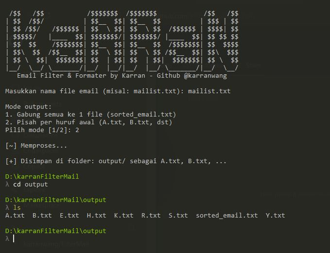

## Preview

Termux


Desktop



## Deskripsi

**Email Filter & Formatter** adalah tool berbasis Python untuk membantu kamu membersihkan, memfilter, dan merapikan daftar email dari file teks. Tool ini sangat berguna bagi yang sering bekerja dengan data email mentah, seperti hasil scraping, database lama, atau file mailing list acak.

---

## Fitur Utama

- Validasi email otomatis (mengabaikan email tidak valid)
- Deteksi dan hapus email duplikat
- Pembersih pemisah umum seperti: `,`, `;`, `|`, `:`, tab, dan spasi
- Opsi output fleksibel:
  - Gabung semua email ke satu file `sorted_email.txt`
  - Bagi berdasarkan huruf awal email ke file per huruf (`A.txt`, `B.txt`, dst)
- Output disimpan ke dalam folder `output/`
- Tampilan terminal bersih dan interaktif

---

## Cara Menjalankan

### 1. Persiapan

Pastikan Python 3 sudah terpasang di sistem kamu.

Pastikan kamu sudah memiliki file mailist.txt nya

jika belum, maka buat terlebih dahulu

### 2. Jalankan Program

```bash
nano mailist.txt
```

```bash
python main.py
```

### 3. Ikuti Petunjuk

Masukkan nama file email, misalnya mailist.txt

Pilih mode output:

[1] Gabung semua email jadi satu file

[2] Pisah berdasarkan huruf awal email


---

Contoh Struktur Output

output/

├── sorted_email.txt         # Jika memilih mode gabung

├── A.txt, B.txt, C.txt ...  # Jika memilih mode pisah per huruf


---

Contoh Input

mailist.txt

john@example.com | jane@domain.co.id : budi@webmail.com   toni@site.org
invalid-email.com; wrong@@test, test@.com, bagus@mail.com

Output (sorted_email.txt)

bagus@mail.com
budi@webmail.com
jane@domain.co.id
john@example.com
toni@site.org


---

Kebutuhan Sistem

Python 3.x

Sistem operasi: Windows / Linux / Termux / MacOS

Tidak membutuhkan library eksternal (pure Python)


---

Lisensi

Proyek ini bersifat open-source dan bebas digunakan untuk keperluan pribadi, pembelajaran, atau pengolahan data internal. Mohon sertakan atribusi jika digunakan secara publik atau dikembangkan lebih lanjut.


---

Penulis

Nama: [Karran Wang]

GitHub: https://github.com/karranwang

Email: [karranwang666@gmail.com]


---

Repository

https://github.com/karranwang/FilterMail

---
